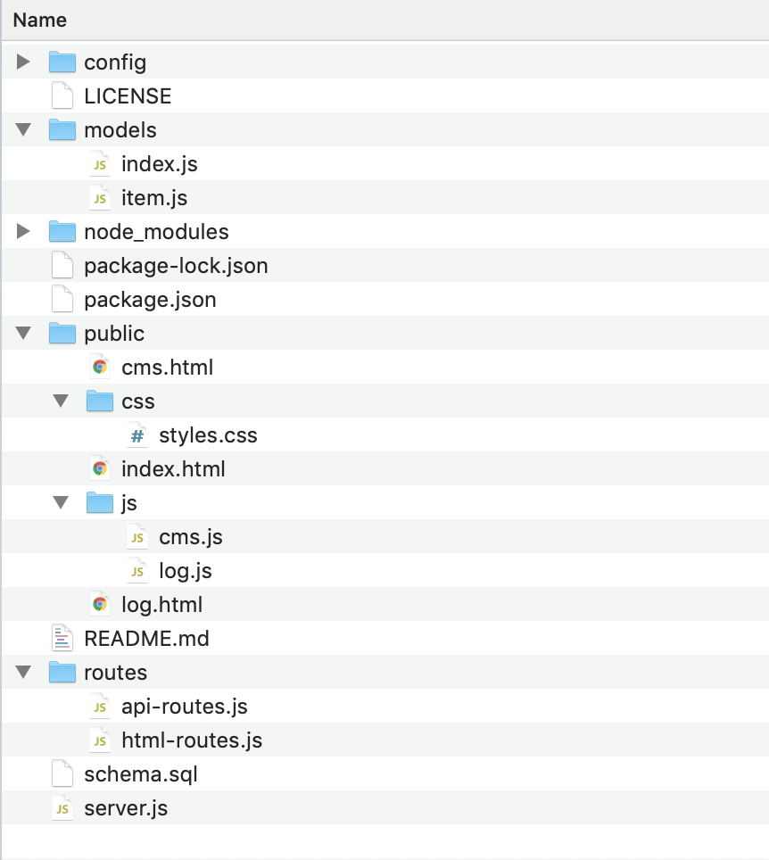

# cabiNet
A web app logger for home items to keep track of pershables, inventory and more.

### Deployed App Link
<a href="https://drive.google.com/file/d/1mrwCmK060H5TdLjL7OJyWVIl63MRYa-h/view">Click for DEMO</a>

https://xxxxx.herokuapp.com/

### Design Plan
This project follows the MVC design pattern - uses Node and Express Web Server to query and route data in the app, MySQL for Database and Sequelize for ORM.

* Has the full CRUD (create, read, update and delete) functionality.

* Utilizes Bootstrap Table plugin which displays data in a tabular format and moment.js for date computations.

* Also utilizes Animate.css and Typed.js for animation of elements in the page and transitions.

* All the files and directories from the steps above follows the structure below:

### Overview

* App has a landing page which gives the user an overview of its functionality. A blinking '+' (add icon) on the logo will lead to the main log page if clicked.

* The main log page is where logged items can be viewed in table form. Dropdown filters and search bar can be used to view specific items.

* Table is sortable and has readable notes especially for perishable items with expiration date.

* Each row of item has the option to edit/update and delete by clicking on the corresponding icons.

* When adding a new item, user can click on the blinking '+' (add icon) on the logo which will lead to the app's log form.

* The log form is where users can enter all the information for adding a new item or updating a previously logged item.

* Must fill Name, Location, Quantity and Unit at a minimum as these are required entries, otherwise form will not submit.

* If item is not perishable, checkbox and form for Expiration are disabled. If Perishable box is checked, only then the Expiration option will be enabled.

* If item is perishable but with no expiration date, user can enter date when item was obtained to keep track of number of days it is at the location, e.g. fruits, left over food, opened canned goods, etc.

* Non-perishables like socks and undergarments can also use the Date Obtained form as option for tracking so items can be replaced when necessary.

* Users can also use the app to keep track of inventory and repurchase low-quantity items when necessary.